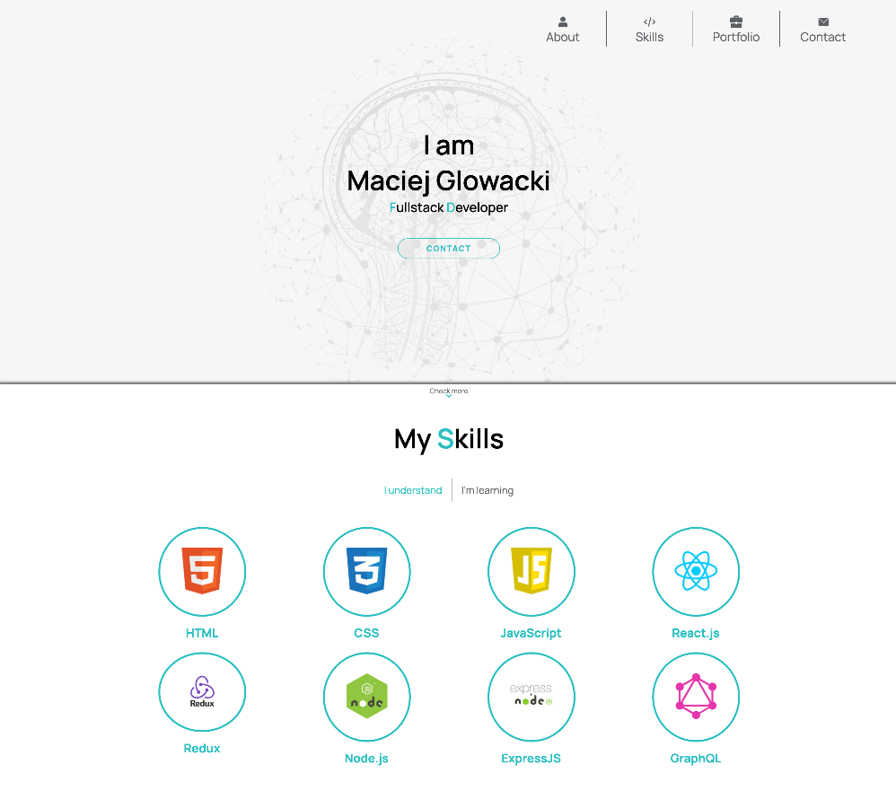
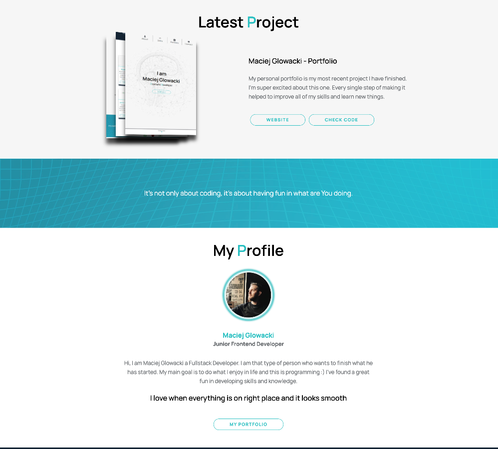

# Portfolio 

My first professional portfolio. 
 
## Goal of the project:
Create a website to present my current skills and abilities, with list of recent projects.

## Lessons Learned:
* How to structure professional website
* Creating DOM with vanilla JS depend on database

## Stack
* HTML
* CSS
* JS Vanilla

### Live
https://maciejgl.github.io/

